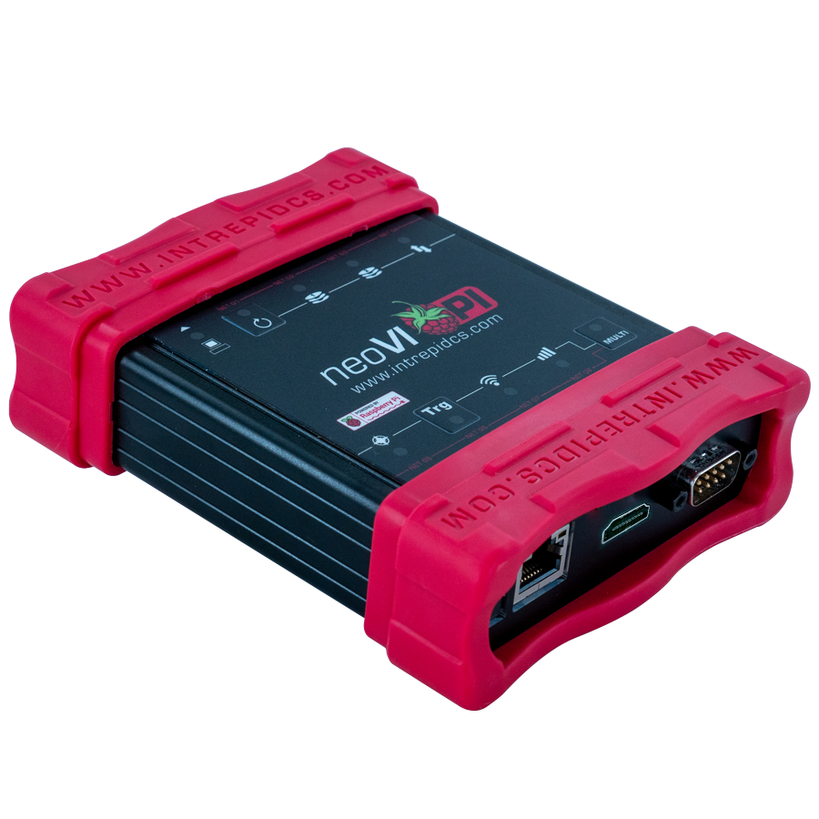

# neoVI PI

<figure><figcaption></figcaption></figure>

### Contents:

### **1.** [**Safety and Other Important Notices**](safety-and-other-important-notices.md)****

### **2.** [**Introduction and Overview**](introduction-and-overview.md)****

### **3.** [**A Tour of neoVI PI Hardware**](a-tour-of-neovi-pi-hardware.md)****

### ****[**4.** Software Setup](software-setup/)

### **5.** [Reference: Connector Pinouts and Cable Signal Mappings](reference-connector-pinouts-and-cable-signal-mappings.md)

### 6. [Support Contact Information](support-contact-information.md)

