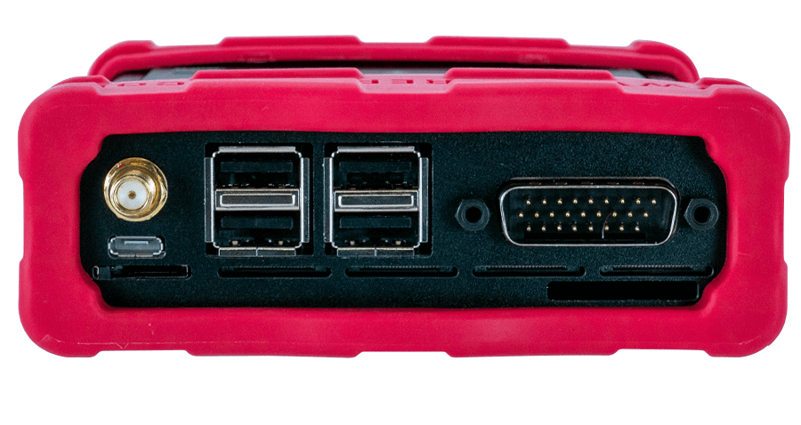
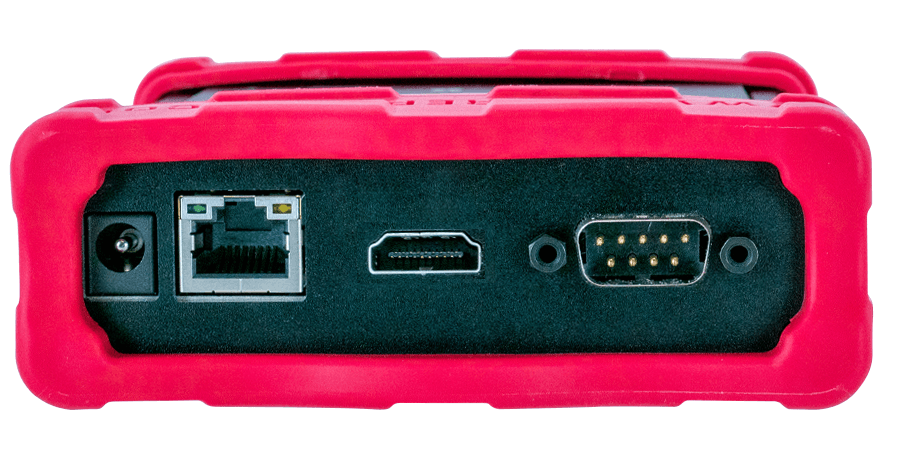
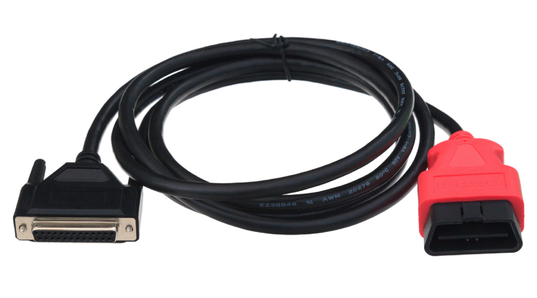
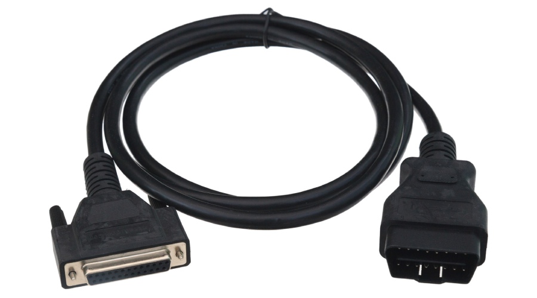
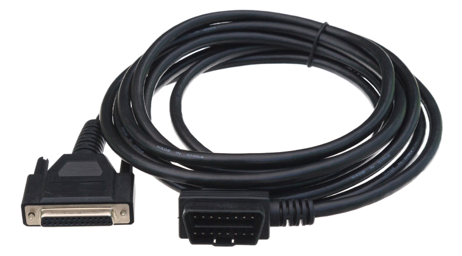
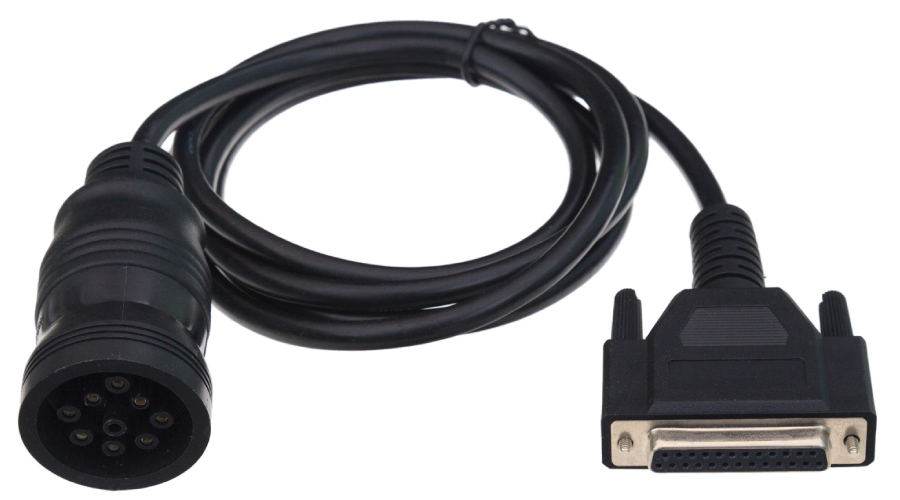

# A Tour of neoVI PI Hardware

### 3. A Tour of neoVI PI Hardware

Let’s now take a short tour of the neoVI PI’s hardware. We’ll examine the device from all sides, showing its external components and explaining what each does. This will help you become more familiar with the unit so you can more easily set up, configure and use it.

Like many Intrepid products, the neoVI PI is designed so that all of its connectors are located on its sides, making the device easier to use in cramped quarters. We’ll refer to these as the left side and right side of the unit, as oriented when facing the device with its top label text readable.


**Warning**

The neoVI PI is a complex device that does not contain any user-serviceable parts. Do not attempt to open the case of the neoVI PI unless specifically instructed to do so by an Intrepid Control Systems technician, or you risk possible injury or damage to the unit.


### 3.1. Case and Overall Design&#x20;

The neoVI PI is enclosed in a sturdy black-anodized metal case. The device has been designed and tested for in-vehicle use, and is operational in a temperature range from -20°C to +85°C. An overall view of the neoVI PI can be seen in Figure 3.&#x20;

Connectors and ports are often a point of failure with hardware devices. To ensure that the neoVI PI provides you with years of reliable service, Intrepid has ruggedized the physical interfaces on the device by using reinforced metal connectors.

To further protect the device against bumps and drops, it has red-colored rubber bumpers on both ends. These bumpers are removable, but there is no need to do this under normal circumstances, and we recommend that you leave them in place.

<figure><figcaption>
Figure 3: Overview of the neoVI PI.
</figcaption></figure>

The bottom of the neoVI PI contains barcode that takes you to reference information, including the device serial number, pinouts of its HD-26 and µDB-9 connectors, and Intrepid’s contact information (Figure 4). Pinouts for all PI connectors and cables can be found in Chapter 8.

### 3.2. Left Side Interfaces and Connectors

<figure><figcaption></figcaption></figure>

### 3.3. Right Side Interfaces and Connectors

<figure><figcaption></figcaption></figure>

### 3.4. Membrane LED Display and Keypad&#x20;

The membrane contains 10 LEDs that provide immediate visual feedback about the status of the device, and two keypad buttons that can be used to toggle the indicator mode and for other functions.

All of the LEDs and buttons are also scriptable: the buttons can be used for user input, and the LEDs can be programmed using Raspberry PI.

### 3.5. Standard Cables and Cable Options

You can purchase neoVI PI with several standard cables. We’ll now illustrate these cables and describe each one’s use.

#### **OBD Cables**

#### neoVI-OBD-1 Cable

This cable, which has a red OBD-II connector, is used primarily for General Motors vehicles. It can be seen in Figure 4.

<figure><figcaption>
Figure 4: neoVI-OBD-1 Cable.
</figcaption></figure>

#### neoVI-OBD-MULTI Cable

This cable has a standard black OBD-II connector and is suitable for use with the vehicles of most OEMs. It is pictured in Figure 5.

<figure><figcaption>
Figure 5: neoVI-OBD-MULTI Cable.
</figcaption></figure>

#### neoVI-OBD-MULTI Right&#x20;

Angle Cable This is the same as the neoVI-OBD-MULTI cable but terminates with a right-angled OBD II connector for vehicles where this is required. A picture of the cable is shown in Figure 6.

<figure><figcaption>
Figure 6: neoVI-OBD-MULTI Right Angle Cable.
</figcaption></figure>

#### neoVI FIRE/RED J1939 Cable&#x20;

This cable terminates in a round 9-pin Deutsch connector for use in commercial vehicles (Figure 7).

<figure><figcaption>
Figure 7: neoVI FIRE/RED J1939 Cable.
</figcaption></figure>

#### FIRE 2 OBD Cable with DoIP Support

&#x20;This special cable attaches to the FIRE 2’s HD-26 connector in place of the regular FIRE 2 Ethernet Cable Adapter. It contains DB-25, DB-9 and OBD-II connectors wired for DoIP use, and is illustrated in Figure 8.

<figure><figcaption>
<strong>Figure 8: FIRE 2 OBD Cable with DoIP Support.</strong>
</figcaption></figure>
