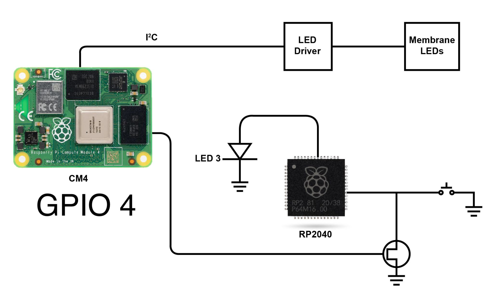

# Control membrane LEDs and Trigger Button

<figure><figcaption></figcaption></figure>

**Note -** \
Before you can address the membrane, you will need to activate the `i2c_vc` interface. To do that you need to run the following command:


```python
echo "dtparam=i2c_vc=on" | sudo tee -a /boot/config.txt
```


After this you need to reboot the pi, `sudo reboot` will do the job.

#### Download the below file to control membrane LEDs and trigger buttons.


