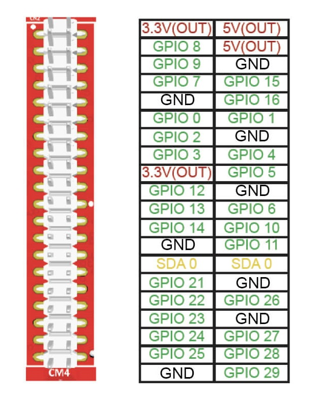

# Reference: Connector Pinouts and Cable Signal Mappings

### 7. Reference: Connector Pinouts and Cable Signal Mappings

<figure><figcaption></figcaption></figure>

#### Flexible Internal Expansion: Take Advantage of GPIO Headers

These open-ended pins can be used for a variety of purposes, most commonly, to collect input such as sensors or interface to other tools or writing your own scripts. There are three different headers for interconnection between four components:

* RP2040 corresponds to the embedded RPi Pico&#x20;
* CM 4 corresponds to the signals from RPi CM 4 signals&#x20;
* DB 9 corresponds to the signals on the DB9 Connector &#x20;
* DB 26 corresponds to signals on the DB 26 connector

**RPi CM4 Pinout (PiHat Compatible)**

<figure><figcaption></figcaption></figure>

**RP2040/Pi Pico Pinout (Matches Pi Pico)**

<figure><figcaption></figcaption></figure>

**Miscellaneous Pinout**

<figure><figcaption></figcaption></figure>
