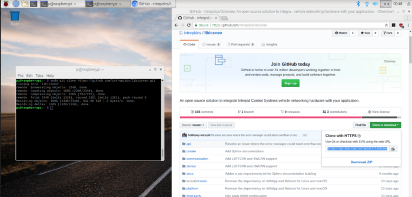
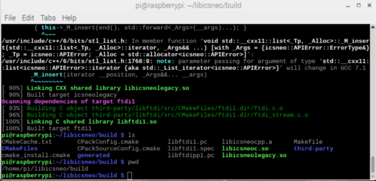
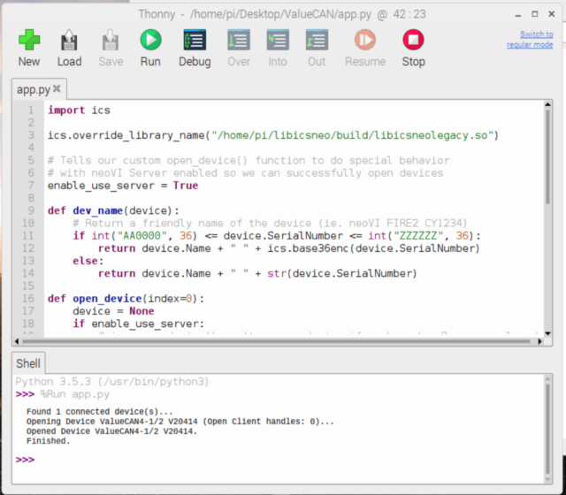
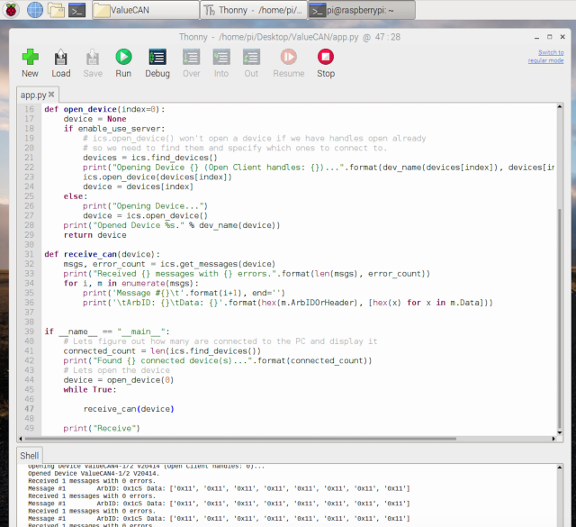
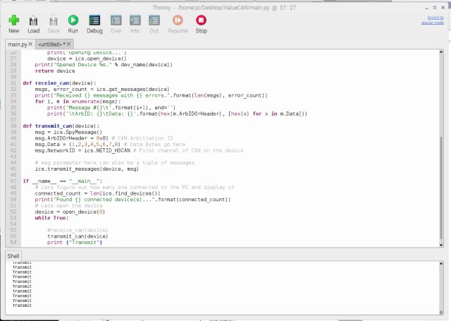

# Software Setup

### 6. **Build libicsneo project and link libicsneoleagacy.so file to your Python project.** <a href="#c893" id="c893"></a>

Open **Terminal**

Clone libicsneo git repository

```bash
git clone “https://github.com/intrepidcs/libicsneo.git”
```

<figure><figcaption></figcaption></figure>

Check to see if you have install all dependencies

<pre class="language-bash"><code class="lang-bash">cd libicsneo/
<strong>git submodule update — recursive — init
</strong>sudo apt install build-essential ninja cmake libusb
</code></pre>

<figure><figcaption></figcaption></figure>

Create a build folder and make the project

```bash
mkdir -p build && cd build && cmake .. & make
```

<figure><figcaption></figcaption></figure>

### **Installing python\_ics** <a href="#e980" id="e980"></a>

To install python\_ics you can use either of this command

```bash
sudo python3 -m pip install python_ics 
```

or

```bash
sudo pip3 install python_ics
```

Create a new Python project and copy paste the example code from the python\_ics or you can download the **open\_device\_example.py** from github page [https://github.com/intrepidcs/python\_ics/blob/master/examples/open\_device\_example.py](https://github.com/intrepidcs/python\_ics/blob/master/examples/open\_device\_example.py)

Open **Python IDE** and **link libicsneolegacy.so** by adding this line at the top of your script

```python
ics.override_library_name(“/home/pi/libicsneo/build/libicsneolegacy.so”)
```

Run your Python file

<figure><figcaption></figcaption></figure>

_**Note if you don’t see your device, try turning off the raspberry Pi and turn back on with device plugged in.**_

### **Receive Messages** <a href="#a867" id="a867"></a>

Use this function to Receive CAN messagespy

```python
def receive_can(device):    
    msgs, error_count = ics.get_messages(device)
    print("Received {} messages with {} errors.".format(len(msgs), error_count))
    for i, m in enumerate(msgs):
       print('Message #{}\t'.format(i+1), end='')
       print('\tArbID: {}\tData: {}'.format(hex(m.ArbIDOrHeader), [hex(x) for x in m.Data]))
```

<figure><figcaption></figcaption></figure>

### Transmit Messages <a href="#632c" id="632c"></a>

Use this function to Transmit CAN messages

```python
def transmit_can(device):
    msg = ics.SpyMessage()
    msg.ArbIDOrHeader = 0x01 # CAN Arbitration ID
    msg.Data = (1,2,3,4,5,6,7,8) # Data Bytes go here
    msg.NetworkID = ics.NETID_HSCAN # First channel of CAN
        # msg parameter here can also be a tuple of messages
    ics.transmit_messages(device, msg)
```

<figure><figcaption></figcaption></figure>

So to recap:

* Build libicsneo project
* install python\_ics
* link libicsneolegacy.so file on your python project

You can read the full documentation for libicsneo at [https://libicsneo.readthedocs.io/en/latest/](https://libicsneo.readthedocs.io/en/latest/) and Python documentation at [https://python-ics.readthedocs.io/en/2.15/](https://python-ics.readthedocs.io/en/2.15/).
