# SocketCAN Kernel

### How to use SocketCAN on a Raspberry Pi 4 (Linux) using ValueCAN 4

<figure>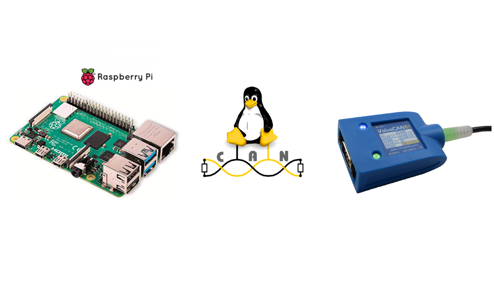<figcaption></figcaption></figure>

Intrepid Control Systems introduced an Open Source API called Libicsneo. This can be used with python\_ics to integrate Intrepid vehicle networking hardware to any Python application running Linux, Mac or Windows. Please refer to [The easy way to program ValueCAN 4 in python using Raspberry Pi (Linux)](https://medium.com/intrepidcontrolsystems/the-easy-way-to-program-valuecan-4-in-python-using-raspberry-pi-linux-68d160d511ef) if you would like to learn how to program your device using Intrepid API.&#x20;

In this tutorial you will learn how to set up the Intrepid SocketCAN kernel module on your Raspberry Pi 4 to work with any Intrepid tool such as ValueCAN 4 series. Please reference the documentation for a list of supported hardware. We will be using [ValueCAN 4–2](https://www.intrepidcs.com/products/vehicle-network-adapters/valuecan-4/valuecan-4-2-overview/) that includes two channels of CAN or CAN FD.&#x20;

### **Hardware Setup**

Connect ValueCAN 4–2 using DB-9F to OBD-II cable to [neoOBD2 Simulator](https://www.intrepidcs.com/products/ecu-simulators/neoobd2-sim/) (optional) to receive or transmit CAN or CAN FD messages instead of a car.

<figure>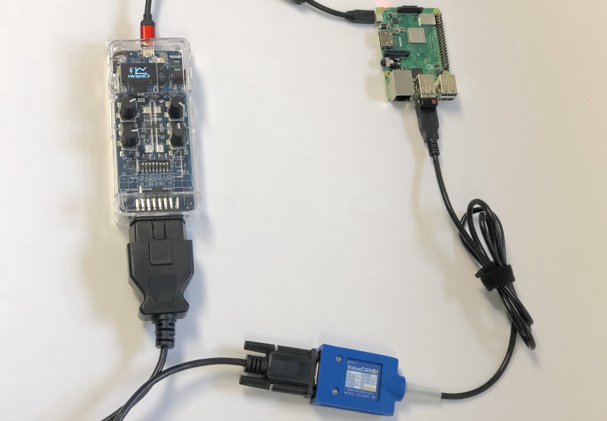<figcaption></figcaption></figure>

#### Open **Terminal**&#x20;

Install **dkms**, the package for **Dynamic Kernel Module Support Framework**. We need the dkms package for Raspberry Pi because it doesn’t have a kernel header. On Ubuntu, this is accomplished by running:&#x20;

```bash
sudo apt install linux-headers-generic build-essential gcc git 

sudo apt-get install dkms

sudo apt install raspberrypi-kernel-headers
```

<figure>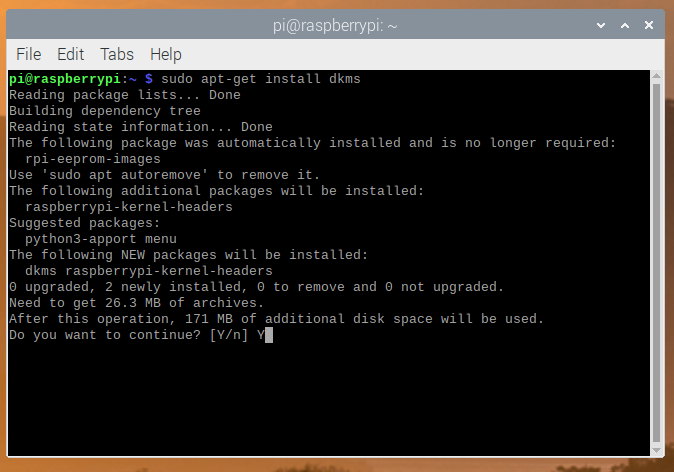<figcaption></figcaption></figure>

#### **Clone Intrepid SocketCAN Kernel Module** from [www.github.com/intrepidcs](http://www.github.com/intrepidcs)

```bash
git clone https://github.com/intrepidcs/intrepid-socketcan-kernel-module.git
```

<figure>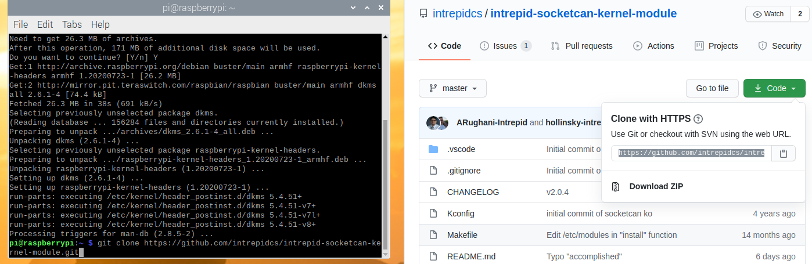<figcaption></figcaption></figure>

Go to the module directory by using:

```bash
cd intrepid-socketcan-kernel-module
```

#### **Make the project to build the KO file** by using the command make

```bash
make
```

<figure>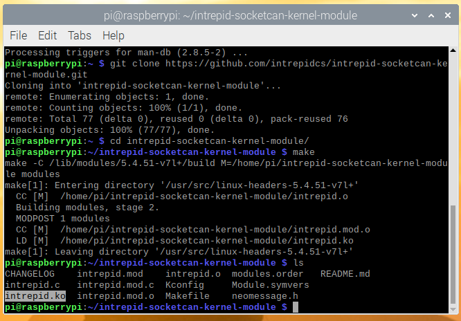<figcaption></figcaption></figure>

The resulting file will be **intrepid.ko**. This module depends on can, can\_dev, and can\_raw. We have a script to help within the makefile, make reload. But If you prefer to run it yourself, you can run using the following command:&#x20;

```bash
sudo modprobe can

sudo modprobe can_raw

sudo modprobe can_dev

sudo insmod intrepid.ko
```

Use `lsmod` to **confirm the module is loaded**.

<figure>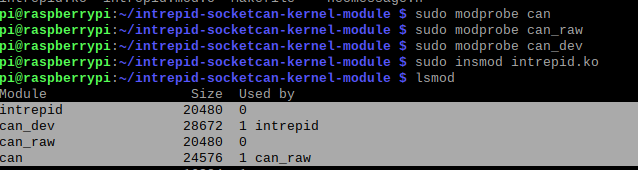<figcaption></figcaption></figure>

If you wish to have the module auto-load on boot, then please follow the instructions on our GitHub page at [https://github.com/intrepidcs/intrepid-socketcan-kernel-module](https://github.com/intrepidcs/intrepid-socketcan-kernel-module). Once you have the Intrepid Socket Kernel Module setup, then we will need to install **icsscand**. Intrepid Icsscand is a user-mode SocketCAN daemon for Intrepid devices.&#x20;

To keep our file system clean, we will move out of the Intrepid SocketCAN Kernel directory by using `cd..` command.

To install the dependencies needed we will run&#x20;

```bash
sudo apt install git cmake gcc libusb-1.0-0-dev libpcap-dev build-essential
```

<figure>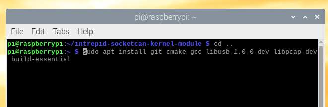<figcaption></figcaption></figure>

Once you have the dependencies installed, then **clone icsscand repository recursively by running**\


```bash
git clone --recursive https://github.com/intrepidcs/icsscand.git
```

<figure>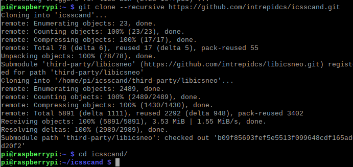<figcaption></figcaption></figure>

Switch into the cloned directory, `cd icsscand` and **make a build directory** and switch into it, `mkdir build && cd build`

<figure>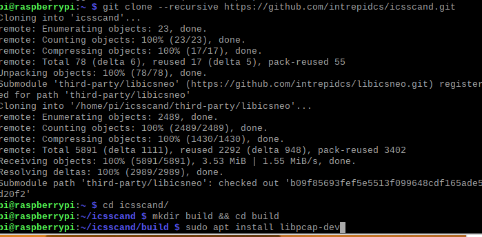<figcaption></figcaption></figure>

#### **Invoke CMake**,

```bash
cmake .. -DCMAKE_BUILD_TYPE=Release 
```

<figure>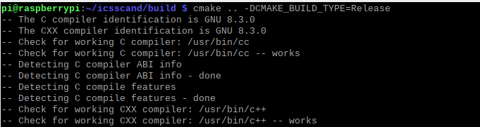<figcaption></figcaption></figure>

#### **Build the daemon**, using the command make

<figure>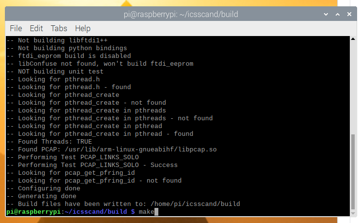<figcaption></figcaption></figure>

Daemon should now be available as **libicsneo-socketcan-daemon**. Daemon allows you to run Intrepid devices in the background. To start the daemon program use

```bash
sudo ./libicsneo-socketcan-daemon
```

<figure>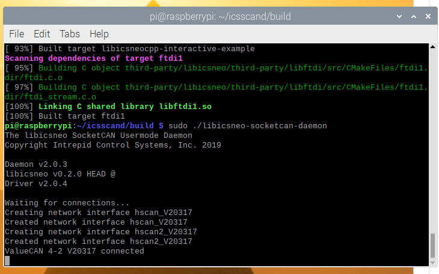<figcaption></figcaption></figure>

If you’re happy with the results and would like to run in the background, run `sudo ./libicsneo-socketcan-daemon -d` to run in daemon mode.

<figure>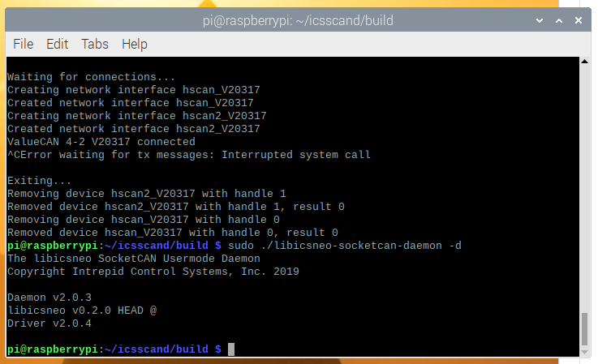<figcaption></figcaption></figure>

To **view your CAN interfaces**, use the command, `sudo ip link`. They will be labeled can0, can1, and etc. They will have an alias listed which corresponds to the serial number of the device and network on that device. To **enable the CAN interface to transmit and receive** with `sudo ip link set up can0`, replacing can0 with whichever interface you’d like to enable

<figure>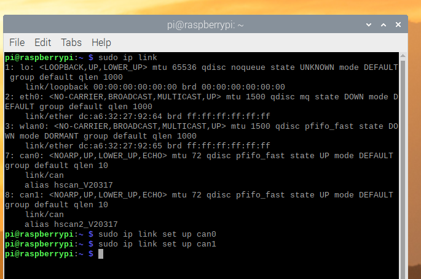<figcaption></figcaption></figure>

You can now use any SocketCAN application with this interface. A good package for testing is the **can-utils** package. You can get this with `sudo apt install can-utils`. A good testing tool which comes with this package is **candump**. Running `candump can0` will print a line for every incoming frame.

<figure>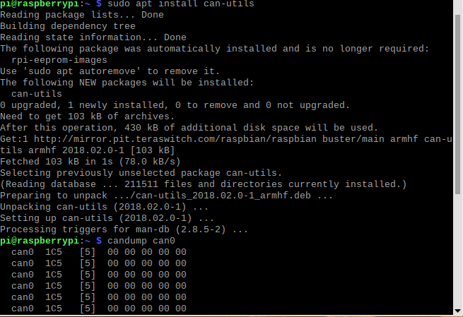<figcaption></figcaption></figure>

#### **So to recap:**&#x20;

Install **Intrepid SocketCAN Kernel Module**&#x20;

Install and start **SocketCAN daemon for Intrepid devices.**

View and enable the **correct CAN Interface**

You can read **intrepid-socketcan-kernel-module** at [https://github.com/intrepidcs/intrepid-socketcan-kernel-module](https://github.com/intrepidcs/intrepid-socketcan-kernel-module) and **icsscand** [https://github.com/intrepidcs/icsscand](https://github.com/intrepidcs/icsscand)
